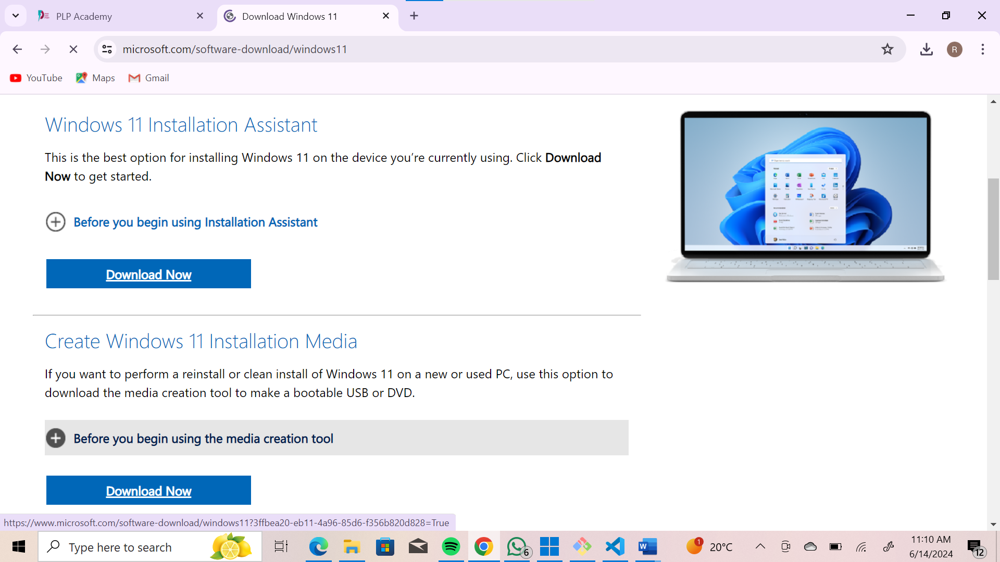
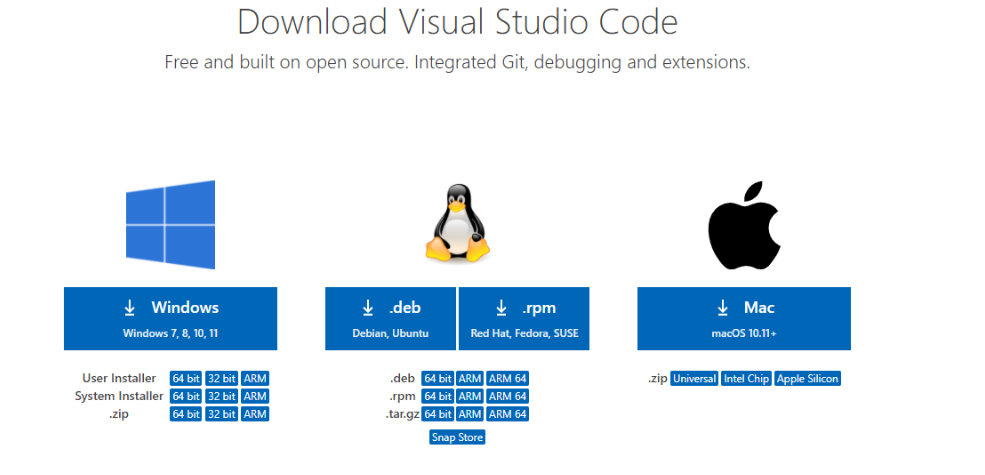
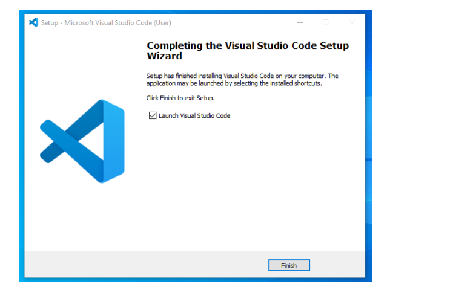
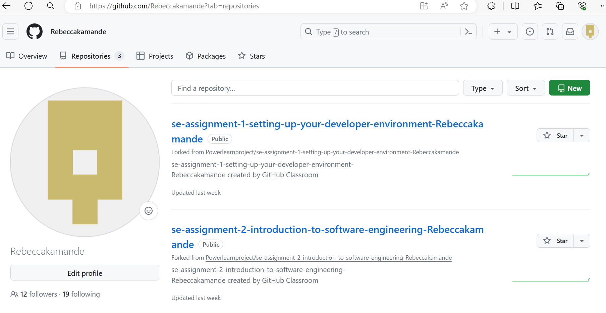

# Dev_Setup
Setup Development Environment

#Assignment: Setting Up Your Developer Environment

#Objective:
This assignment aims to familiarize you with the tools and configurations necessary to set up an efficient developer environment for software engineering projects. Completing this assignment will give you the skills required to set up a robust and productive workspace conducive to coding, debugging, version control, and collaboration.

#Tasks:

1. Select Your Operating System (OS):
   Choose an operating system that best suits your preferences and project requirements. Download and Install Windows 11. https://www.microsoft.com/software-download/windows11

2. Install a Text Editor or Integrated Development Environment (IDE):
   Select and install a text editor or IDE suitable for your programming languages and workflow. Download and Install Visual Studio Code. https://code.visualstudio.com/Download
3. Set Up Version Control System:
   Install Git and configure it on your local machine. Create a GitHub account for hosting your repositories. Initialize a Git repository for your project and make your first commit. https://github.com

4. Install Necessary Programming Languages and Runtimes:
  Instal Python from http://wwww.python.org programming language required for your project and install their respective compilers, interpreters, or runtimes. Ensure you have the necessary tools to build and execute your code.

5. Install Package Managers:
   If applicable, install package managers like pip (Python).

6. Configure a Database (MySQL):
   Download and install MySQL database. https://dev.mysql.com/downloads/windows/installer/5.7.html

7. Set Up Development Environments and Virtualization (Optional):
   Consider using virtualization tools like Docker or virtual machines to isolate project dependencies and ensure consistent environments across different machines.

8. Explore Extensions and Plugins:
   Explore available extensions, plugins, and add-ons for your chosen text editor or IDE to enhance functionality, such as syntax highlighting, linting, code formatting, and version control integration.

9. Document Your Setup:
    Create a comprehensive document outlining the steps you've taken to set up your developer environment. Include any configurations, customizations, or troubleshooting steps encountered during the process. 

#Deliverables:
- Document detailing the setup process with step-by-step instructions and screenshots where necessary.
- A GitHub repository containing a sample project initialized with Git and any necessary configuration files (e.g., .gitignore).
- A reflection on the challenges faced during setup and strategies employed to overcome them.

#Submission:
Submit your document and GitHub repository link through the designated platform or email to the instructor by the specified deadline.

#Evaluation Criteria:**
- Completeness and accuracy of setup documentation.
- Effectiveness of version control implementation.
- Appropriateness of tools selected for the project requirements.
- Clarity of reflection on challenges and solutions encountered.
- Adherence to submission guidelines and deadlines.

Note: Feel free to reach out for clarification or assistance with any aspect of the assignment.

#Installing windows 11
1.	Checking for Compatibility
If your PC meets the requirements, it should display a green checkmark stating that your PC is compatible.
2.	Back up your PC just in case. Your upgrade to Windows 11 should be smooth and seamless, but just if something goes wrong, backing up will ensure you don't lose any of your files.
3.	Open "Update and Security" in Settings. Use ⊞ Win+I, or head to your Start menu, click the gear icon to open Settings, and then click on the "Update and Security" tab.
4.	Click Download and install on the Windows 11 menu. It should be a blue background that notifies you that your PC is ready.
5.	Follow through with the download process! You'll be prompted with a license agreement, which you need to accept. Then, a window will pop up, in which the download will take place
6.	Restart your PC. After it is done installing, the window will prompt you to restart your PC and start a countdown of 30 minutes. Simply hit "Restart now."
7.	Let your PC run the installation process. Your computer will automatically run the installation process.
8.	Head to the official download website (www.microsoft.com/en-us/software-download/windows11).

9.	Select your download option. The recommended one is the Installation Assistant—this is the same as what you would use if you upgraded via Settings.
10.	Follow through with the process. You'll be prompted with a license agreement, which you need to accept. Then, a window will pop up, in which the download will take place.
11.	Restart your PC. After it is done installing, the window will prompt you to restart your PC and start a countdown of 30 minutes. Simply hit "Restart now."
12.	Let your PC install Windows 11. Your computer will automatically run the installation process.
Complete! After installation, the Windows 11 start-up screen will appear. Log in as you normally would and start exploring the new features of Windows 11.

#Problems faced when installing windows 11
Problem: There might not be enough free space on your hard drive to install Windows 11.
Solution: Free up space on your hard drive by deleting unnecessary files, uninstalling programs you don't use, or moving files to an external storage device.
Problem: Third-party antivirus software or other programs can sometimes interfere with the Windows 11 installation process.
Solution: Try temporarily disabling your antivirus software and any other non-essential programs before installing Windows 11. Remember to re-enable them after the installation is complete.
Problem: Your PC might not meet the minimum system requirements for Windows 11.
Solution: Check your PC's manufacturer website to see if your model is compatible with Windows 11. You can also use the official Microsoft PC Health Check app to see if your device is compatible

#Installing VS code
1.	Visit the Official Website of the Visual Studio Code using any web browser like Google Chrome, Microsoft Edge, etc. 
2.	Press the “Download for Windows” button on the website to start the download of the Visual Studio Code Application.
3.	When the download finishes, then the Visual Studio Code Icon appears in the downloads folder.
4.	Click on the Installer icon to start the installation process of the Visual Studio Code.
5.	 After the Installer opens, it will ask you to accept the terms and conditions of the Visual Studio Code. Click on I accept the agreement and then click the Next button.
6.	Choose the location data for running the Visual Studio Code. It will then ask you to browse the location. Then click on the Next button.
7.	Then it will ask to begin the installation setup. Click on the Install button.
8.	After clicking on Install, it will take about 1 minute to install the Visual Studio Code on your device.
9.	After the Installation setup for Visual Studio Code is finished, it will show a window like this below. Tick the “Launch Visual Studio Code” checkbox and then click Next.

#Problems encountered while downaloading VS code
Problem: You might not have administrator rights on your PC to install software.
Solution: Try running the installer with administrator privileges. Right-click the installer and select "Run as administrator".
Problem: Your antivirus software might be blocking the VS Code installation.
Solution: Try temporarily disabling your antivirus software during the installation. Remember to re-enable it afterwards.

#Creating a Github account
1.	Go to https://github.com/join in a web browser.
2.	Enter your personal details, including a username and email address.
3.	Click the green Create an account button.
4.	Complete the CAPTCHA puzzle.
5.	Click the Choose button for your desired plan. One you select a plan, GitHub will send you an email to verify your email address.

#Problems encountered
Problem: Weak password.
Solution: Create a strong password.

#Installing Python
1.	Select Version to Install Python. Visit the official page for Python https://www.python.org/downloads/
2.	Download the Python Installer.
3.	Once you have downloaded the installer, open the .exe file, such as python-3.10.11-amd64.exe, by double-clicking it to launch the Python installer.
5.	Running the Executable Installer
6.	After completing the setup. Python will be installed on your Windows system. You will see a successful message.
7. Verify the Python Installation in Windows.

#Installing MySQL
1.	Downloading MySQL. Head to the official MySQL Installer for Windows page: https://dev.mysql.com/downloads/installer/
2.	Launching the Installer.
3.	Choosing Your Setup
4.	Upon reaching the “Choosing a Setup Type” screen, select the “Server” option to install all available MySQL features. Click on “Next” to proceed.
5.	The installer will now verify if your system meets the necessary requirements. If any issues arise, select each problematic item and click “Execute”. 
This lets the installer handle and install any missing requirements automatically. Once resolved, hit the “Next” button.
6.	On the “Installation” screen, review the list of products set for installation. Click “Execute” and let the installer do its job. Once done, move ahead by pressing “Next”.
7.	The “Product Configuration” screen will appear. Here:
Select “MySQL Server 8.0.34”. Hit “Next”. Choose the “Standalone MySQL Server/Classic MySQL Replication” setup. For “Type and Networking”, select “Development Computer”, set “Connectivity” to “TCP/IP”, and assign Port . Press “Next” to continue.
8.	In the “Authentication Method” section, ensure you choose “Use Strong Password Encryption for Authentication”. Move on by clicking “Next”.
9.	In the “Accounts and Roles” section, set up a password for the root account. Remember this password for future reference. Click “Next”.
10.	Windows Service Configuration
11.	This step allows MySQL to run as a Windows service. Stick with the default settings and click “Next”.
12.	On the “Apply Configuration” screen, hit the “Execute” button. Once the server configuration is applied, click “Finish”.
13.	Wrapping Up Product Configuration. You’ll be notified once the product configuration completes. Keep the default settings intact. Click “Next” and then “Finish” to wrap up the MySQL installation.
14.	The “Installation Complete” screen indicates a job well done! Click “Finish” to close the installer.

#Problems enncountered while installing MySQL
Problem: Wrong configuration.
Solution: Follow Step-by-step Tutorials.

